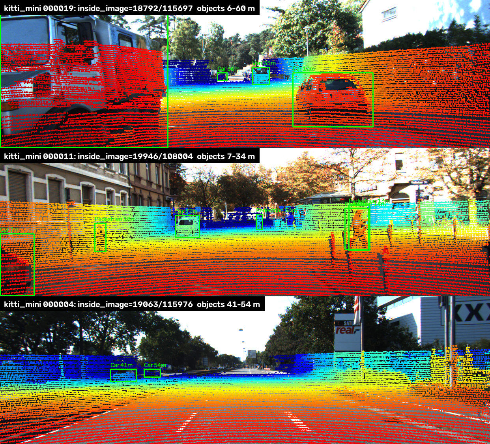
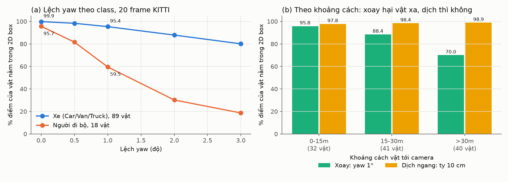
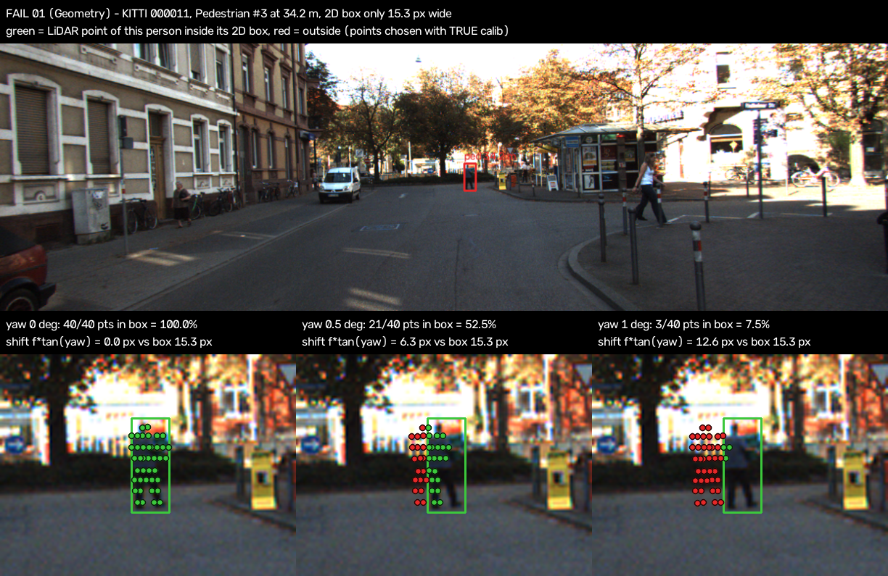
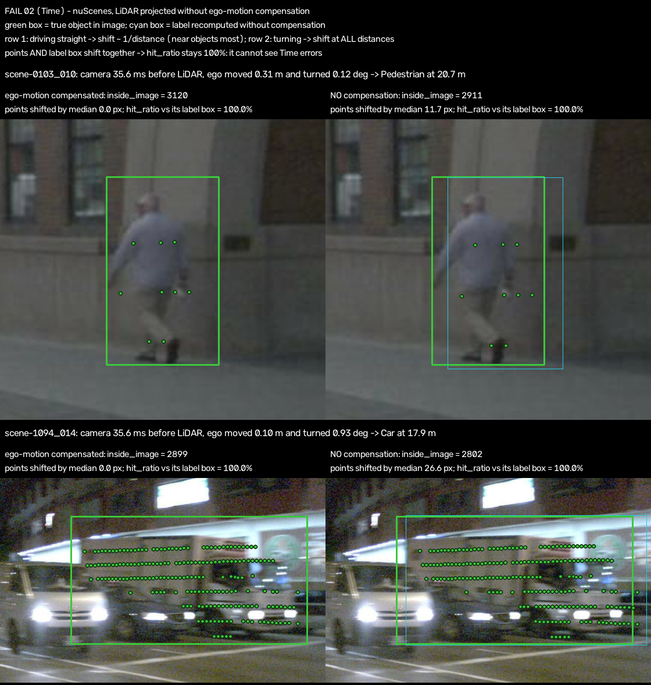
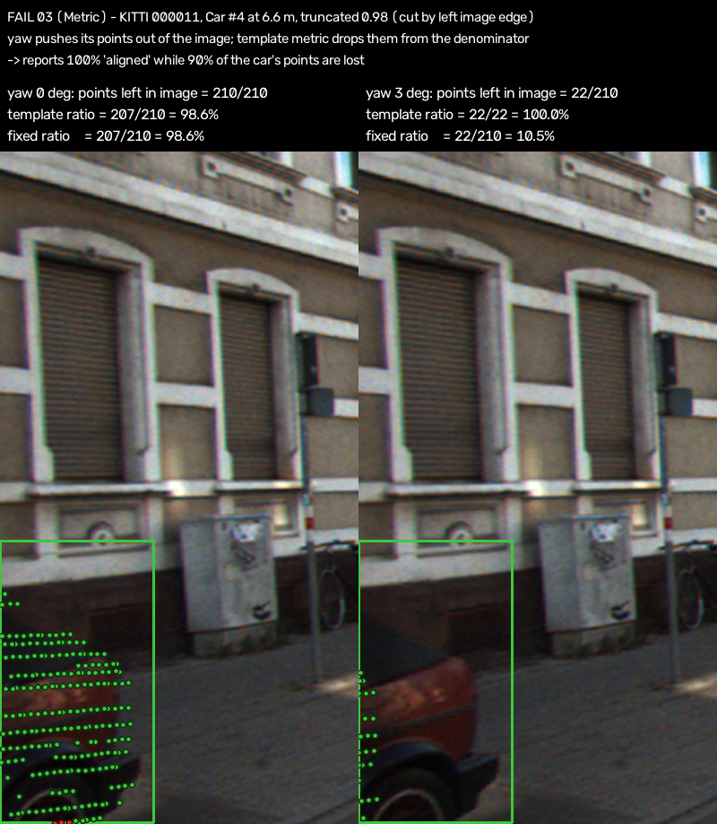

# Báo cáo Day 6: Calibration lệch xoay và lệch dịch ảnh hưởng thế nào tới projection LiDAR → camera

- **Họ tên:** Vũ Đức Thiện
- **MSSV:** 2A202602437
- **Lớp:** VinUni AI20K K4 · Track 4 (Computer Vision and Robotics)
- **Link repo:** https://github.com/vuthien3002-sys/VuDucThien-2A202602437-Track4-Day21
- **Topic:** A — LiDAR-camera projection QA
- **Dataset:** data/kitti_mini (chính), data/nuscenes_mini_subset (so sánh + lỗi thời gian), data/synthetic (debug)
- **Các frame đã dùng:** KITTI 000008, 000011, 000049 (thí nghiệm chính); 000004, 000019 (demo xa/gần); cả 20 frame kitti_mini cho bảng theo class/khoảng cách. nuScenes: cả 80 keyframe scene-0103_000…039 (ngày) và scene-1094_000…039 (đêm), failure Time ở scene-0103_010

## 1. Claim

**Claim cuối cùng:** Lệch yaw 1° làm tỉ lệ điểm LiDAR của **người đi bộ** rơi đúng vào 2D box giảm **36 điểm phần trăm** (95.7 → 59.5 %), trong khi **xe** chỉ giảm **4.5 điểm** (99.9 → 95.4 %) — KITTI 20 frame, lặp lại trên nuScenes (99.9 → 61.5 % và 99.9 → 95.2 %). Lệch **xoay** hại vật **xa** (yaw 1°: 95.8 % ở < 15 m → 70.0 % ở > 30 m), còn lệch **dịch** 10 cm thì **không** phụ thuộc khoảng cách (97.8 / 98.4 / 98.9 %).

**Claim nháp (CP1)** và kết luận: *"Lệch yaw 1° làm tỉ lệ của người đi bộ giảm hơn 20 điểm %, xe con dưới 5 điểm %; ngược lại lệch dịch 10 cm chủ yếu hại vật gần (< 15 m), vật > 30 m gần như không đổi."* → Vế 1 **đúng** (36 và 4.5 điểm). Vế 2 **bị bác bỏ**: dịch làm điểm trượt `f·d/z` pixel (lớn ở vật gần, đúng như lý thuyết), nhưng vật gần cũng to hơn đúng tỉ lệ `f·W/z`, nên tỉ lệ trượt = `d/W` không phụ thuộc khoảng cách (người đi bộ: 89 / 84 / 85 %).

## 2. Evidence

**Demo (CP2).** Overlay điểm LiDAR (màu theo độ sâu) + 2D box của label ở 3 frame gần / trung bình / xa. Hàm chiếu tự viết khớp đúng số kỳ vọng: `inside_image` = 3910 / 19946 / 3120 điểm (synthetic / KITTI 000011 / nuScenes scene-0103_010).



**Metric.** `hit_ratio` = (số điểm trong 3D box GT, chọn bằng calib **gốc**) rơi vào 2D box của vật khi chiếu bằng calib **đã lệch** ÷ (số điểm đó nằm trong ảnh theo calib gốc). Mỗi lần chỉ lệch **1 trục** (`perturb_extrinsic`, quay/dịch trong velodyne frame), giữ nguyên frame, class (Car, Van, Truck, Pedestrian, Cyclist), range. Không có phép ngẫu nhiên → chạy lại 2 lần ra CSV giống từng byte (đã kiểm `filecmp`).

**Kiểm tra cài đặt:** chạy script mẫu `src/exp_yaw_sweep.py` trên 000008 / 000011 / 000049 ra **đúng 15/15 số** của bảng kỳ vọng (vd 000011: 99.45 → 91.88 → 77.44 → 45.44 → 21.23 %) → `results/yaw_perturb_sweep.csv`, [yaw_sweep.png](../results/figures/yaw_sweep.png).

**Kết quả chính (KITTI, 20 frame, 113 vật)** — `results/calib_sweep_summary_kitti_mini.csv`:

| Lệch yaw | Xe (Car/Van/Truck, 89 vật) | Người đi bộ (18 vật) | Tất cả |
|---|---|---|---|
| 0° | 99.9 % | 95.7 % | 99.6 % |
| 0.5° | 98.4 % | 81.6 % | 97.2 % |
| **1°** | **95.4 %** (−4.5 điểm) | **59.5 %** (−36.2 điểm) | 92.9 % |
| 2° | 87.9 % | 30.2 % | 84.0 % |
| 3° | 80.1 % | 18.6 % | 76.0 % |

| Theo khoảng cách (tất cả vật) | 0–15 m (32 vật) | 15–30 m (41) | > 30 m (40) |
|---|---|---|---|
| calib đúng | 99.6 % | 99.5 % | 99.7 % |
| xoay yaw 1° | 95.8 % | 88.4 % | **70.0 %** |
| xoay pitch 1° | 94.3 % | 89.3 % | **65.6 %** |
| dịch ngang ty 10 cm | 97.8 % | 98.4 % | 98.9 % |
| dịch đứng tz 10 cm | 97.2 % | 98.1 % | 97.7 % |
| dịch ngang ty 10 cm, chỉ người đi bộ | 89.1 % | 83.6 % | 85.4 % |



- Lệch xoay càng hại khi vật càng **xa**: độ trượt `f·tanθ` ≈ 12.6 px không đổi theo khoảng cách, còn bề rộng vật `f·W/z` co lại → tỉ lệ trượt/bề rộng = `z·tanθ/W` tăng tuyến tính theo z. Người đi bộ (W ≈ 0.6 m, box trung vị 28 px) hỏng nặng hơn xe (W ≈ 1.6 m + chiều dài).
- Lệch dịch **không** chủ yếu hại vật gần như claim nháp dự đoán: cả độ trượt `f·d/z` lẫn bề rộng `f·W/z` đều tỉ lệ 1/z → tỉ lệ trượt = `d/W`, **không phụ thuộc khoảng cách** (người đi bộ: 89 / 84 / 85 %). Pixel trượt lớn ở vật gần là đúng, nhưng vật gần cũng to tương ứng.
- Yaw hại vật **hẹp**, pitch hại vật **thấp**: pitch 1° làm xe giảm còn 92.2 % (nặng hơn yaw), người chỉ còn 88.0 %. Roll 1° (98.3 %) và dịch dọc tx (99.7 %) gần như vô hại.

**Ngưỡng phát hiện drift (Advanced)** — `results/drift_detection_kitti.csv`, [drift_detection.png](../results/figures/drift_detection.png). Mỗi frame tính 1 `hit_ratio`, cảnh báo khi < ngưỡng:

| Ngưỡng | Báo nhầm ở 0° | Phát hiện yaw 0.5° | yaw 1° | yaw 2° | yaw 3° |
|---|---|---|---|---|---|
| 95 % | 1/20 (frame 000048, mức sàn 92.0 %) | 10/20 | 14/20 | 20/20 | 20/20 |
| 90 % | 0/20 | 6/20 | 10/20 | 16/20 | 20/20 |

6 frame **không phát hiện được yaw 1°** ở ngưỡng 95 % (000008, 000010, 000019, 000021, 000031, 000032) là các frame mà điểm bị **xe gần** chi phối: trung vị 82 % điểm vật thể thuộc xe < 15 m và 0 % thuộc người/xe đạp (các frame phát hiện được: 0 % và 14 %). Tỉ lệ gộp theo điểm vì thế "mù" với drift nhỏ khi frame thiếu vật hẹp/xa. Mức sàn ở 0° chưa phải 100 % vì 2D box do người vẽ không khớp tuyệt đối với 3D box (người đi bộ 95.7 %).

**[B5] So sánh KITTI và nuScenes** (cùng code, cùng metric, 80 keyframe nuScenes, 1146 vật) — `results/calib_sweep_summary_nusc.csv`, [kitti_vs_nuscenes.png](../results/figures/kitti_vs_nuscenes.png):

| | KITTI | nuScenes |
|---|---|---|
| Tiêu cự / ảnh | 721.5 px, 1242×375 | 1253–1266 px, 1600×900 |
| Điểm LiDAR / vật có điểm (trung vị) | 113 (64 beam) | 4 (32 beam) |
| calib đúng: tất cả / người đi bộ | 99.6 % / 95.7 % | 99.9 % / 99.9 % |
| yaw 1°: tất cả / xe / người | 92.9 / 95.4 / 59.5 % | 92.2 / 95.2 / 61.5 % |
| xoay quanh trục ngang 1° (KITTI `pitch` = nuScenes `roll`) | 91.8 % | 95.1 % |
| dịch ngang 10 cm, người đi bộ (KITTI `ty` = nuScenes `tx`) | 87.2 % | 97.4 % |
| yaw 1° người: ngày (scene-0103) / đêm (scene-1094) | — | 48.6 % / 68.6 % |

Vì sao giống/khác: (1) yaw 1° gần như **trùng nhau** dù nuScenes trượt 1253·tan1° ≈ 21.9 px (KITTI 12.6 px): ảnh nuScenes phóng vật lớn theo đúng tỉ lệ f, nên f **bị triệt tiêu** (`z·tanθ/W`). (2) Mức sàn nuScenes ≈ 100 % và người đi bộ chịu dịch tốt hơn (97.4 % so với 87.2 %) vì 2D box nuScenes **không do người vẽ** mà là bao của 8 góc 3D box chiếu lên ảnh → rộng hơn dáng người, có lề. (3) Trục LiDAR nuScenes là x-phải, y-trước nên `pitch` trong code của nuScenes thực chất là roll của xe; phải ghép đúng trục vật lý mới so sánh được. (4) Đêm/ngày không làm metric kém đi (LiDAR là cảm biến chủ động); khác biệt 48.6 / 68.6 % đến từ khoảng cách: người đi bộ ban đêm gần hơn (khoảng cách trung bình theo số điểm 19.4 m so với 25.5 m ban ngày). (5) nuScenes chỉ 4 điểm/vật → tỉ lệ theo từng vật rất nhiễu, phải gộp nhiều vật.

**[B2] Stress test suy giảm dữ liệu** (2 loại × 3 mức, seed = 0) — `results/degradation_summary.csv`, [degradation_sweep.png](../results/figures/degradation_sweep.png): giữ 30 % điểm (`random_dropout`) hay thêm nhiễu σ = 10 cm (`gaussian_noise`), `hit_ratio` gộp vẫn 99.6 / 99.4 % ở 0° và 93.1 / 92.8 % ở yaw 1°; tỉ lệ frame bị cờ gần như không đổi (5 % ở 0°, 65–70 % ở 1° ở mọi mức). Metric là **tỉ lệ** nên bỏ điểm không làm lệch nó; nhiễu chỉ làm mẫu số giảm 40 105 → 35 642 điểm. Kết luận: bài kiểm tra calibration bền với mưa/bụi/nhiễu, giới hạn thật nằm ở **nội dung frame** (có vật hẹp/xa hay không).

**[B3] Latency** (CPU Intel i7-8850H, 12 luồng, 15.8 GB RAM, không GPU; 50 lần đo, bỏ lần đầu) — `results/latency_qa.csv`, `results/latency_summary.csv`, `results/latency_hardware.txt`:

| Frame | Số điểm | Chỉ projection p50 / p95 | Cả bài kiểm tra 1 frame p50 / p95 |
|---|---|---|---|
| KITTI 000011 | 108 004 | 12.3 / 18.6 ms | 54.4 / 61.7 ms |
| nuScenes scene-0103_010 | 34 720 | 2.6 / 3.0 ms | 21.4 / 24.7 ms |

**[B1] So sánh 2 metric trên cùng dữ liệu:** `hit_ratio` (cần label 3D + 2D) so với `edge_score` (không cần label: điểm LiDAR ở mép độ sâu có trùng cạnh Canny của ảnh không, theo ý tưởng Levinson & Thrun 2013) — `src/exp_edge_alignment.py`, `results/edge_vs_hit_summary.csv`, [edge_vs_hit.png](../results/figures/edge_vs_hit.png), [edge_alignment_demo.png](../results/figures/edge_alignment_demo.png). AUROC = xác suất một frame calib đúng có điểm cao hơn một frame bị lệch (1 = tách hoàn hảo, 0.5 = đoán mò):

| Phép thử | AUROC hit_ratio | AUROC edge_score | Số frame metric giảm (hit / edge) |
|---|---|---|---|
| KITTI yaw 0.25° vs 0° | 0.82 | 0.55 | 18 / 15 trên 20 |
| KITTI yaw 0.5° vs 0° | **0.92** | 0.62 | 19 / 18 trên 20 |
| KITTI yaw 1° vs 0° | **0.98** | 0.72 | 20 / 19 trên 20 |
| nuScenes lỗi Time (46 frame điểm dời > 8 px) | 0.47 | 0.53 | 4 / **28** trên 46 |

Ưu/nhược: `hit_ratio` tách tốt nhất với một ngưỡng cố định vì mức sàn ổn định (92–100 % ở 0°), nhưng cần label và **mù** với lỗi nằm chung chuỗi biến đổi với label (lỗi Time trên nuScenes, Fail 02). `edge_score` không cần label và có tín hiệu với lỗi Time (giảm ở 28/46 frame, trung bình 0.249 → 0.225), nhưng phụ thuộc cảnh: ở 0° đã trải từ 0.29 (frame 000061) tới 0.78 nên ngưỡng cố định kém (AUROC 0.62 ở 0.5°); chỉ dùng được kiểu **tương đối** (so với chính frame đó, panel b). Failure riêng của `edge_score`: nuScenes 32 beam chỉ có ~15–19 điểm mép độ sâu mỗi frame (KITTI ~528) → theo từng frame gần như đoán mò, phải gộp nhiều frame.

**[B4] Tool dùng lại được:** `python -m src.exp_calib_sweep --help` — quét 6 trục (`--axes yaw pitch roll tx ty tz`), mức lệch (`--rot-levels`, `--trans-levels`), dataset bất kỳ (`--data-root`), tắt bù chuyển động (`--ignore-ego-motion`); mặc định chạy được ngay. `src/exp_degradation.py`, `src/exp_edge_alignment.py`, `src/bench_latency.py`, `src/demo_overlays.py`, `src/make_failures.py`, `src/plot_results.py` cũng có `--help` và chạy được với tham số mặc định.

## 3. Failure case

### Fail 01 — Geometry: người đi bộ ở xa mất gần hết điểm khi lệch yaw 1°



- **Trường hợp:** KITTI frame `000011`, người đi bộ thứ 3 (dòng 4 của `label_2/000011.txt`, `obj_id = 3` trong CSV), cách 34.2 m, 2D box chỉ rộng 15.3 px, có 40 điểm LiDAR.
- **Quan sát:** tỉ lệ điểm của người này nằm trong box: 40/40 = 100 % (0°) → 21/40 = 52.5 % (0.5°) → 3/40 = 7.5 % (1°) → 0 % (2°). Cả frame 000011 tụt 99.5 → 77.4 % ở 1°, trong khi frame xe 000008 vẫn 98.6 %.
- **Nguyên nhân:** lệch yaw θ đẩy mọi điểm sang ngang `f·tanθ` = 721.5·tan1° = 12.6 px **ở mọi khoảng cách**, trong khi người 0.6 m ở 34 m chỉ rộng ~15 px → điểm trượt 82 % bề rộng box. Tổng quát: tỉ lệ trượt = `z·tanθ/W`, lớn khi vật **xa** và **hẹp**.
- **Lớp debug:** Geometry — extrinsic `Tr_velo_to_cam` sai (giá đỡ LiDAR bị xoay). Code chiếu không sai: self-test `(10,0,0) → (614,175)` vẫn pass.
- **Phát hiện khi chạy thật:** theo dõi `hit_ratio` trên vật **hẹp, xa** (người đi bộ, cột > 20 m) chứ không chỉ gộp toàn frame: 6/20 frame KITTI bị xe gần chi phối (82 % điểm) **không phát hiện** được yaw 1° với ngưỡng 95 %. Ngưỡng 95 % gộp theo frame: báo nhầm 1/20 frame ở 0°, bắt 14/20 frame ở 1°, 20/20 ở 2°.

### Fail 02 — Time: bỏ bù chuyển động 35.6 ms, và metric `hit_ratio` không nhìn thấy lỗi này



- **Trường hợp:** nuScenes, chiếu LiDAR lên CAM_FRONT với `--ignore-ego-motion`: `scene-0103_010` (xe đi thẳng 8.6 m/s) và `scene-1094_014` (xe đang rẽ). Bảng cho cả 80 keyframe: `results/time_sync_nusc.csv`.
- **Quan sát:** `scene-0103_010`: inside_image 3120 → 2911, điểm bị dời trung vị 10.0 px, **giảm theo độ sâu**: 25.0 px (< 10 m), 11.4 px (10–20 m), 5.8 px (20–40 m), 2.3 px (> 40 m). `scene-1094_014`: dời 21.3 px gần như **đều mọi độ sâu** (19.1 px ở < 10 m, 21.1 px ở > 40 m) dù xe chỉ chạy 2.9 m/s. Thế nhưng `hit_ratio` vẫn **100 %** ở cả hai, và trên 80 frame chỉ đổi 99.93 → 99.92 %.
- **Nguyên nhân:** camera chụp **trước** LiDAR 34.2–39.5 ms ở mọi frame. Xe đi thẳng thì lỗi là một phép **dịch** 0.31 m → dời `f·d/z` (vật gần dời nhiều). Xe rẽ 0.93° trong 35.6 ms thì lỗi là một phép **xoay** → dời 1266·tan0.93° ≈ 20.5 px ở mọi khoảng cách, giống hệt lỗi yaw calibration. `hit_ratio` không thấy vì 2D box nuScenes được **tính từ 3D box qua cùng ego pose** với điểm (`nuscenes_io._labels`), nên box dời cùng điểm.
- **Lớp debug:** Time (không đồng bộ / không deskew), kèm Metric (box tham chiếu không độc lập với chuỗi biến đổi đang kiểm tra).
- **Phát hiện khi chạy thật:** ghi log `dt = t_camera − t_lidar`, tốc độ và tốc độ quay của xe mỗi frame; cảnh báo khi độ dời dự đoán `|v·dt|` > 0.1 m hoặc `|ω·dt|` > 0.2°. Kiểm tra Time phải dùng tham chiếu **độc lập từ ảnh** (2D detector của camera, cạnh Canny), không dùng box suy ra từ 3D label.

### Fail 03 — Metric: script mẫu báo 100 % "khớp" cho xe sát mép ảnh dù 90 % điểm đã bị đẩy ra ngoài



- **Trường hợp:** KITTI `000011`, xe thứ 4 cách 6.6 m, `truncated = 0.98` (bị mép trái ảnh cắt), lệch yaw 3°.
- **Quan sát:** `hit_ratio` của script mẫu = 22/22 = **100 %** (còn cao hơn mức 98.6 % ở 0°), trong khi thực tế chỉ 22/210 = **10.5 %** điểm còn trong box. Gộp 20 frame ở yaw 3°: script mẫu 79.8 % so với 76.0 % khi giữ mẫu số cố định (mẫu số tụt 40 105 → 38 917 điểm). Tương tự `000049` xe 17: 100 % so với 20.4 %. Metric "số điểm trong ảnh" còn tệ hơn: 19 946 → 19 948 khi yaw 0° → 3°.
- **Nguyên nhân:** script mẫu tính `sel = points_in_box(cam_true) & mask` với `mask` lấy từ phép chiếu **đã lệch** → điểm bị đẩy ra ngoài ảnh biến mất khỏi mẫu số thay vì bị tính là trượt; vật sát mép ảnh vì thế trông "khớp hoàn hảo".
- **Lớp debug:** Metric.
- **Khắc phục / phát hiện:** dùng mẫu số cố định theo calib gốc (`hit_ratio_fixed` trong `src/exp_calib_sweep.py`), luôn log kèm `object_points` để thấy mẫu số co lại, và báo riêng các vật `truncated > 0.5`.

## 4. Khuyến nghị nếu triển khai thật

- **Use-case:** xe tự hành / robotaxi đô thị ≤ 50 km/h có LiDAR mái + camera trước (giống nuScenes), cần biết giá đỡ cảm biến có bị xoay sau va chạm nhẹ, rửa xe, rung hay giãn nở nhiệt không — trước khi fusion LiDAR-camera đặt nhầm điểm LiDAR của người đi bộ lên nền.
- **Cách kiểm tra:** thay label GT bằng output của detector (3D box từ LiDAR, 2D box từ detector **camera** để tham chiếu độc lập) và tính `hit_ratio` (mẫu số cố định) **chỉ trên vật hẹp/xa** (người, cột, xe đạp > 20 m) — đây là nhóm nhạy nhất (yaw 1°: người 34 m còn 7.5 %, xe gần vẫn 95 %). Thêm `edge_score` làm kiểm tra không cần detector, dùng kiểu tương đối (calib hiện tại so với ±0.5°).
- **Đánh đổi:** một lần kiểm tra tốn 54 ms CPU (KITTI 108 k điểm) / 21 ms (nuScenes) trên i7-8850H. Chạy mỗi frame ở 10 Hz ≈ 54 % một nhân; chạy 1 Hz hoặc khi xe dừng đèn đỏ chỉ ≈ 5 % nhưng phát hiện chậm hơn hàng chục giây — chấp nhận được vì drift calibration là lỗi chậm, không tức thời. An toàn: ngưỡng 95 % theo từng frame báo nhầm 1/20 frame, ngưỡng 90 % không báo nhầm nhưng chỉ bắt 10/20 frame ở yaw 1° → **không** cảnh báo theo 1 frame mà theo trung vị một cửa sổ nhiều lần kiểm tra, và bỏ qua lần kiểm tra không có vật hẹp/xa (6/20 frame KITTI bị xe gần chi phối không thấy được yaw 1°). Bài kiểm tra bền với suy giảm dữ liệu (giữ 30 % điểm hay nhiễu 10 cm vẫn cho cùng kết quả, B2), nên không cần tắt khi mưa.
- **Chỉ số cần ghi log:** `hit_ratio` theo class × khoảng cách; `object_points` (mẫu số) và số vật hẹp/xa trong mỗi lần kiểm tra (biết lần đó có đáng tin không); `dt = t_camera − t_lidar`, tốc độ và tốc độ quay của xe (lỗi Time: rẽ 0.93° trong 35.6 ms đã lệch 21 px); `inside_image` chỉ để phát hiện lỗi I/O; sự kiện va chạm từ IMU, nhiệt độ giá đỡ. Đề xuất: cảnh báo "cần hiệu chỉnh lại" khi trung vị `hit_ratio` của người/vật xa < 90 % liên tục 5 phút; khi đó hạ trọng số fusion camera cho vật > 30 m.
- **Bước tiếp theo:** tự hiệu chỉnh online bằng cách tìm yaw/pitch làm `edge_score` lớn nhất; kiểm tra lại trên nhiều scene mưa/đêm hơn và với detector thật thay cho label.

## 5. Cách chạy lại

Các lệnh tái tạo lại toàn bộ kết quả từ repo sạch.

```bash
# 0. Môi trường (Windows máy GBK cần bật UTF-8 mode, nếu không pip đọc requirements.txt bị lỗi)
python -m venv .venv && .venv\Scripts\activate          # macOS/Linux: source .venv/bin/activate
set PYTHONUTF8=1                                         # PowerShell: $env:PYTHONUTF8=1 ; bash: export PYTHONUTF8=1
pip install -r requirements.txt

# 1. CP2: tự kiểm 2 hàm TODO + overlay (in đúng inside_image = 3910 / 19946 / 3120)
python -m src.test_projection
python -m starter.projection --data-root data/synthetic --frame 000000
python -m starter.projection --data-root data/kitti_mini --frame 000011
python -m starter.projection --data-root data/nuscenes_mini_subset --frame scene-0103_010
python -m src.demo_overlays          # -> results/figures/demo_overlay_3_distances.png (000019 gần, 000011, 000004 xa)

# 2. CP3: thí nghiệm chính (tất định, chạy lại ra cùng CSV)
python -m src.exp_yaw_sweep --data-root data/kitti_mini --frames 000008 000011 000049   # script mẫu -> yaw_perturb_sweep.csv
python -m src.exp_calib_sweep                                                         # KITTI 20 frame × 6 trục (~15 s)
python -m src.exp_calib_sweep --data-root data/nuscenes_mini_subset --tag nusc        # [B5] nuScenes 80 frame (~15 s)
python -m src.plot_results           # -> yaw_sweep.png, claim_rot_vs_trans.png, kitti_vs_nuscenes.png, drift_detection.png
python -m src.exp_degradation        # [B2] -> degradation_summary.csv, degradation_sweep.png (seed = 0)
python -m src.bench_latency          # [B3] -> latency_qa.csv, latency_summary.csv (số ms thay đổi nhẹ theo máy)

# 3. CP4: failure case
python -m src.make_failures          # -> fail_01/02/03_*.png + time_sync_nusc.csv (80 keyframe nuScenes)
python -m src.exp_calib_sweep --data-root data/nuscenes_mini_subset --axes yaw --ignore-ego-motion --tag nusc_noego
python -m starter.projection --data-root data/nuscenes_mini_subset --frame scene-0103_010 --ignore-ego-motion   # 3120 -> 2911
python -m starter.projection --data-root data/kitti_mini --frame 000011 --yaw-deg 2                             # nhìn bằng mắt

# 4. [B1] hit_ratio vs edge_score (chạy SAU make_failures vì đọc time_sync_nusc.csv)
python -m src.exp_edge_alignment     # -> edge_vs_hit_summary.csv, edge_vs_hit.png, edge_alignment_demo.png (~20 s)

# 5. Kiểm tra hình thức trước khi nộp
python tools/check_submission.py
```

Mọi script đều chạy từ **gốc repo** bằng `python -m src.<tên>` (không chạy `python src/<tên>.py`), có `--help`. Tất cả số liệu tất định (không có phép ngẫu nhiên, riêng B2 dùng `seed = 0`) trừ số ms của latency.

## 6. Khai báo sử dụng AI

| Công cụ | Dùng cho việc gì | Đã kiểm chứng thế nào |
|---|---|---|
| Claude Code (model Claude Opus 5.5, Anthropic) | Đọc đề + hướng dẫn lab; viết 2 hàm TODO trong `starter/projection.py`; viết toàn bộ code trong `src/`; chạy thí nghiệm, vẽ biểu đồ, tạo ảnh failure; soạn nháp REPORT. Các commit có dòng `Co-Authored-By: Claude` | Self-test `src.test_projection` pass (`z_cam` = 9.73, pixel (614, 175)); 3 overlay in đúng 3910 / 19946 / 3120; script mẫu ra đúng 15/15 số kỳ vọng; chạy lại thí nghiệm → CSV giống từng byte (`filecmp`); xem bằng mắt từng ảnh/biểu đồ; đối chiếu mọi con số trong REPORT với CSV trong `results/`; công thức `f·tanθ`, `f·d/z` kiểm lại bằng tay (721.5·tan1° = 12.6 px) |
| Codelab Day 6 (script mẫu) | `src/test_projection.py` (Phần 04) và `src/exp_yaw_sweep.py` (Phần 05) giữ nguyên làm điểm xuất phát. Mở rộng thành `src/exp_calib_sweep.py`: 6 trục lệch, tính theo từng vật, chia class/khoảng cách, mẫu số cố định, chạy cả nuScenes; thêm ngưỡng phát hiện drift, B1, B2, B3, phân tích lỗi Time | Lọc bản mở rộng về đúng 4 class và cách tính mẫu số của script mẫu (`hit_ratio_template`) → ra lại đúng 15/15 số và đúng mẫu số `object_points` của script mẫu |
| Bảng màu biểu đồ (dataviz reference palette) | Màu categorical đã kiểm định cho người mù màu trong `src/plot_results.py` | Xem lại biểu đồ, nhãn không chồng nhau |
